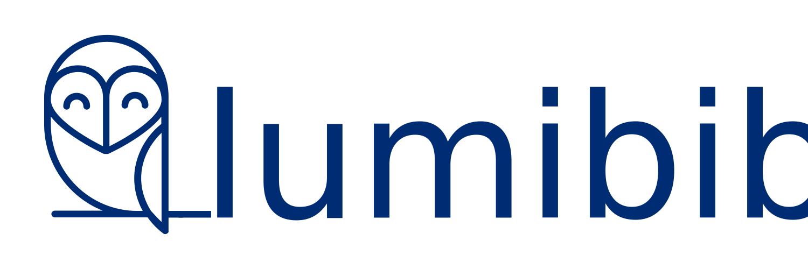

    

  <strong>Assets and branding for Lumibib</strong>

  This repository contains our static assets and serves them to our <a href="#endpoints">Endpoints</a>.

  <h3>
    <a href="#endpoints">Endpoints</a>
     | 
    <a href="https://lumibib.github.io/assets/">Documentation</a>
     | 
    <a href="#contributing">
      Contributing
    </a>
  </h3>

  Built with ❤︎ by
  <a href="https://lumibib.ch">Lumibib</a> and
  <a href="https://github.com/lumibib/assets/contributors">
    contributors
  </a>
  

## Table of Contents

- [Endpoints](#endpoints)
- [Usage](#usage)
- [Contributing](#contributing)
- [License](#license)

## Endpoints

We store our static assets in this repository, GitHub Pages publishes it and jsDelivr CDN fetch it.

* **Github Pages**: https://lumibib.github.io/assets
* **Lumibib CDN**: https://assets.lumibib.ch
* **jsDelivr CDN**: https://cdn.jsdelivr.net/gh/lumibib/assets/
* **jsDelivr package**: https://www.jsdelivr.com/package/gh/lumibib/assets
* **Statically CDN**: https://cdn.statically.io/gh/lumibib/assets/master/logo/logo-lumibib-color.svg

## Usage

For example, our logo is available at :

* https://lumibib.github.io/assets/logo/logo-lumibib-color.svg
* https://assets.lumibib.ch/logo/logo-lumibib-color.svg
* https://cdn.jsdelivr.net/gh/lumibib/assets@latest/logo/logo-lumibib-color.svg

With jsDelivr CDN, you can choose a specific release or a specific git commit hash:

* https://cdn.jsdelivr.net/gh/lumibib/assets@latest/logo/logo-lumibib-color.svg
* https://cdn.jsdelivr.net/gh/lumibib/assets@b96d07edc4c0debe1fe38da344137accf6a55dba/logo/logo-lumibib-color.svg

With Statically CDN, you can choose a specific branch, tag or git commit hash:
* https://cdn.statically.io/gh/lumibib/assets/master/logo/logo-lumibib-color.svg

### Logo

<table>
  <tr>
    <td style="text-align: center">
      
      
SVG logo

    </td>
    <td style="text-align: center">
      
      
SVG logo square

  </td>
  </tr>
</table>

### Colors

<table>
  <tr>
    <td style="text-align: center">
      
      
<code>#ebebeb</code>

    </td>
    <td style="text-align: center">
      
      
<code>#ff4f73</code>

    </td>
    <td style="text-align: center">
      
      
<code>#ffd009</code>

    </td>
    <td style="text-align: center">
      
      
<code>#1274ed</code>

  </td>
    <td style="text-align: center">
      
      
<code>#002c73</code>

  </td>
    <td style="text-align: center">
      
      
<code>#0d1821</code>

  </td>
  </tr>
</table>

### Assets

…

## Contributing

We’re really happy to accept contributions from the community, that’s the main reason why we open-sourced it! There are many ways to contribute, even if you’re not a technical person.

1. Fork it (<https://github.com/lumibib/assets/fork>)
2. Create your feature branch (`git checkout -b feature/fooBar`)
3. Commit your changes (`git commit -am 'Add some fooBar'`)
4. Push to the branch (`git push origin feature/fooBar`)
5. Create a new Pull Request

## License

Our logo and other static assets are available under [CC BY 4.0](https://creativecommons.org/licenses/by/4.0/). Our logo is based on [Owl](https://thenounproject.com/term/owl/1498942/) by [ester barbato](https://thenounproject.com/barbato.ester/) from [The Noun Project](https://thenounproject.com), licensed under [CC BY 3.0](https://creativecommons.org/licenses/by/3.0/).
