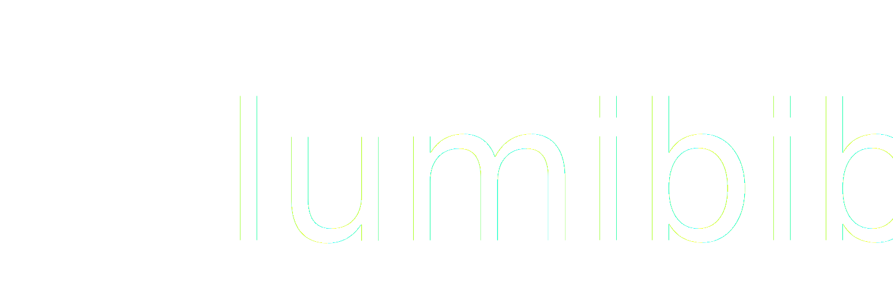

[](https://www.jsdelivr.com/package/gh/lumibib/assets)


<p align="center">
    
</p>
<div align="center">
  <strong>Assets and branding for Lumibib</strong>
</div>
<div align="center">
  This repository contains our static assets and serves them to our <a href="#endpoints">Endpoints</a>.
</div>

<div align="center">
  <h3>
    <a href="#endpoints">Endpoints</a>
    <span> | </span>
    <a href="https://lumibib.github.io/assets/">Documentation</a>
    <span> | </span>
    <a href="#contributing">
      Contributing
    </a>
  </h3>
</div>

<div align="center">
  <sub>Built with ❤︎ by
  <a href="https://lumibib.ch">Lumibib</a> and
  <a href="https://github.com/lumibib/assets/contributors">
    contributors
  </a>
  </sub>
</div>


## Table of Contents

- [Assets](#assets)
  - [Endpoints](#endpoints)
  - [Usage](#usage)
  - [Logo](#logo)
  - [Images](#images)
- [Colors](#colors)
- [Avatar](#avatar)
- [Contributing](#contributing)
- [License](#license)

## Assets
### Endpoints

We store our static assets in this repository, GitHub Pages publishes it and jsDelivr CDN fetch it.

* **Github Pages**: https://lumibib.github.io/assets
* **jsDelivr CDN**: https://cdn.jsdelivr.net/gh/lumibib/assets/
* **jsDelivr package**: https://www.jsdelivr.com/package/gh/lumibib/assets
* **Statically CDN**: https://cdn.statically.io/gh/lumibib/assets/master/logo/logo-lumibib-color.svg

### Usage

For example, our logo is available at :

* https://lumibib.github.io/assets/logo/logo-lumibib-color.svg
* https://cdn.jsdelivr.net/gh/lumibib/assets@latest/logo/logo-lumibib-color.svg

With jsDelivr CDN, you can choose a specific release or a specific git commit hash:

* https://cdn.jsdelivr.net/gh/lumibib/assets@latest/logo/logo-lumibib-color.svg
* https://cdn.jsdelivr.net/gh/lumibib/assets@b96d07edc4c0debe1fe38da344137accf6a55dba/logo/logo-lumibib-color.svg

With Statically CDN, you can choose a specific branch, tag or git commit hash:
* https://cdn.statically.io/gh/lumibib/assets/master/logo/logo-lumibib-color.svg

```` html
<!DOCTYPE html>
<html lang="en">
<head>
    <meta charset="utf-8" />
    <meta name="viewport" content="width=device-width, initial-scale=1">

    <title>Lumibib</title>
    <link rel="shortcut icon" href="https://cdn.jsdelivr.net/gh/lumibib/assets@latest/favicon/favicon.ico" type="image/x-icon">

    <link href="https://fonts.googleapis.com/css2?family=Inter:wght@300;400;700&family=Montserrat:wght@500;700&display=swap" rel="stylesheet" >
    <link href="https://cdn.jsdelivr.net/gh/lumibib/assets@latest/css/theme.min.css" rel="stylesheet">
    <link href="https://cdn.jsdelivr.net/gh/lumibib/assets@latest/css/vendor.min.css" rel="stylesheet">
    <link href="https://cdn.jsdelivr.net/npm/@fortawesome/fontawesome-free@5.15.1/css/all.min.css" rel="stylesheet">
</head>
<body>
  <!-- Content -->
  <script src="https://cdn.jsdelivr.net/gh/lumibib/assets@latest/js/vendor.min.js"></script>
  <script src="https://cdn.jsdelivr.net/gh/lumibib/assets@latest/js/theme.min.js"></script>
  <script src="https://cdn.jsdelivr.net/gh/lumibib/assets@latest/js/theme-initialization.min.js"></script>
</body>
````

### Logo

<table>
  <tr>
    <td style="text-align: center;">
      <a href="https://cdn.jsdelivr.net/gh/lumibib/assets@latest/logo/logo-lumibib-color.svg">
        
      </a>
      <div>Color</div>
    </td>
    <td style="text-align: center;">
      <a href="https://cdn.jsdelivr.net/gh/lumibib/assets@latest/logo/logo-lumibib-white.svg">
        
      </a>
      <div>White</div>
    </td>
  </tr>
  </table>
  <table>
  <tr>
    <td style="text-align: center;">
      <a href="https://cdn.jsdelivr.net/gh/lumibib/assets@latest/logo/logo-lumibib-square.svg">
        
      </a>
      <div>Square</div>
    </td>
    <td style="text-align: center;">
      <a href="https://cdn.jsdelivr.net/gh/lumibib/assets@latest/logo/logo-lumibib-square-grey.svg">
        
      </a>
      <div>Square grey</div>
    </td>
    <td style="text-align: center;">
      <a href="https://cdn.jsdelivr.net/gh/lumibib/assets@latest/logo/logo-lumibib-square-blue.svg">
        
      </a>
      <div>Square blue</div>
    </td>
    <td style="text-align: center;">
      <a href="https://cdn.jsdelivr.net/gh/lumibib/assets@latest/logo/logo-lumibib-square-yellow.svg">
        
      </a>
      <div>Square yellow</div>
    </td>
    <td style="text-align: center;">
      <a href="https://cdn.jsdelivr.net/gh/lumibib/assets@latest/logo/logo-lumibib-square-red.svg">
        
      </a>
      <div>Square red</div>
    </td>
  </tr>
</table>

### Favicon

<table>
  <tr>
    <td style="text-align: center;">
      <a href="https://cdn.jsdelivr.net/gh/lumibib/assets@latest/favicon/favicon.ico">
        
      </a>
      <div>Favicon logo</div>
    </td>
  </tr>
</table>

### Images
Illustrations, graphics and icons are created from theses [providers](https://htmlstream.com/front/documentation/credits.html#free-design-sources).

* **Endpoint** : https://cdn.jsdelivr.net/gh/lumibib/assets@master/images/

## Colors

<table>
  <tr>
    <td style="text-align: center">
      
      <div><code>#ebebeb</code></div>
    </td>
    <td style="text-align: center">
      
      <div><code>#ff4f73</code></div>
    </td>
    <td style="text-align: center">
      
      <div><code>#ffd009</code></div>
    </td>
    <td style="text-align: center">
      
      <div><code>#1274ed</code></div>
  </td>
    <td style="text-align: center">
      
      <div><code>#002c73</code></div>
  </td>
    <td style="text-align: center">
      
      <div><code>#0d1821</code></div>
  </td>
  </tr>
</table>

Thanks to [dummyimmage](https://github.com/kingkool68/dummyimage) for the square generation.

## Avatar

We use two solutions to generate avatar or profile images. Gravatar uses an md5 hash of an email address or a username. ui-avatars requires a full name.

* **Gravatar**: https://www.gravatar.com/avatar/14c4b06b824ec593239362517f538b29?d=identicon&s=200
* **ui-avatars**: https://eu.ui-avatars.com/api/?name=John%20Doe

## Images optimization

Optimize and resize images effortlessly with [Statically](https://statically.io/docs/using-images/).
* **Endpoint**: `https://cdn.statically.io/img/:domain/h=:pixel,q=:percentage/:image`
* https://cdn.statically.io/img/lumibib.ch/w=300,h=500/foo.jpg
* https://cdn.statically.io/img/lumibib.ch/f=auto,w=600,h=400/bar.jpg

## Contributing

We’re really happy to accept contributions from the community, that’s the main reason why we open-sourced it! There are many ways to contribute, even if you’re not a technical person.

1. Fork it (<https://github.com/lumibib/assets/fork>)
2. Create your feature branch (`git checkout -b feature/fooBar`)
3. Commit your changes (`git commit -am 'Add some fooBar'`)
4. Push to the branch (`git push origin feature/fooBar`)
5. Create a new Pull Request

## License

The trademarks, logos and other static assets ("Marks") displayed on this repository are the property of Lumibib. You are not permitted to use these Marks without the prior written consent of Lumibib. Our logo is based on [Owl](https://thenounproject.com/term/owl/1498942/) by [ester barbato](https://thenounproject.com/barbato.ester/) from [The Noun Project](https://thenounproject.com), licensed under [CC BY 3.0](https://creativecommons.org/licenses/by/3.0/).
